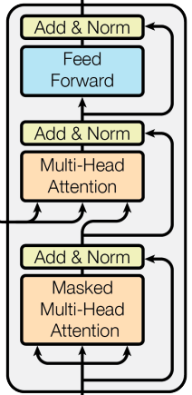

A decoder block is an abstraction of [Multi-Head Self-Attention](Multi-Head%20Self-Attention.md)

---
## Definition
Let $X \in \mathbb{R}^{n \times d}$ be a (per attention-head) masked sequence representation.
### Decoder-only
A decoder-only layer consists of masked multi-head self-attention (M-MHSA) and a feed-forward network (FFN):
$$
\begin{aligned}
Z_1 &= \text{M-MHSA}(X), \\
X_1 &= LN(X + Z_1), \\
\text{Decoder}_{\text{only}}(X) &= LN\!\big(X_1 + FFN(X_1)\big).
\end{aligned}
$$
### With Cross Attention
Let $E \in \mathbb{R}^{m \times d}$ denote the encoder output sequence, where:
- $m$ is the source sequence length,
- $d$ is the model (embedding) dimension,
- each row of $E$ is a contextualized representation of an input token produced by the encoder.

A decoder layer with cross-attention consists of M-MHSA, cross-attention (MHCA), and FFN:
$$
\begin{aligned}
Z_1 &= \text{M-MHSA}(X), \\
X_1 &= LN(X + Z_1), \\
Z_2 &= \text{MHCA}(X_1, E), \\
X_2 &= LN(X_1 + Z_2), \\
\text{Decoder}(X, E) &= LN\!\big(X_2 + FFN(X_2)\big).
\end{aligned}
$$
Where:
- $\text{M-MHSA}(X)$ uses a causal mask and internally computes $Q,K,V$ from $X$.
- $\text{MHCA}(X_1, E)$ uses queries from $X_1$ and keys/values derived from $E$ (i.e., $K,V$ come from the encoder output).
---
## Example
Using the masked self-attention result from [Masked Self-Attention](Masked%20Self-Attention.md) as $Z_{M\text{-}MHSA}$ (single head, H=1) and the encoder output from [Encoder Block](Encoder%20Block.md):
$$
Z_{M\text{-}MHSA} = \begin{bmatrix} 1.00 & 2.00 \\ 2.34 & 3.34 \\ 3.50 & 4.50 \end{bmatrix}, \qquad
E = \mathrm{Encoder}(X) = \begin{bmatrix} -1 & 1 \\ -1 & 1 \\ -1 & 1 \end{bmatrix}
$$
Assume decoder input:
$$
X = \begin{bmatrix} 1 & 2 \\ 1 & 2 \\ 1 & 2 \end{bmatrix}
$$

### Step 1: M-MHSA — Residual + LayerNorm
$$
X + Z_{M\text{-}MHSA} = \begin{bmatrix} 2.00 & 4.00 \\ 3.34 & 5.34 \\ 4.50 & 6.50 \end{bmatrix}
$$
Each row has equal spacing between its two features, so LayerNorm always yields $[-1, 1]$ per row:
$$
X_1 = \mathrm{LN}(X + Z_{M\text{-}MHSA}) = \begin{bmatrix} -1 & 1 \\ -1 & 1 \\ -1 & 1 \end{bmatrix}
$$

### Step 2: Cross Attention — $\mathrm{MHCA}(X_1, E)$
With identity projections, $Q = X_1$ and $K = V = E$:
$$
QK^T = \begin{bmatrix} -1 & 1 \\ -1 & 1 \\ -1 & 1 \end{bmatrix} \begin{bmatrix} -1 & -1 & -1 \\ 1 & 1 & 1 \end{bmatrix} = \begin{bmatrix} 2 & 2 & 2 \\ 2 & 2 & 2 \\ 2 & 2 & 2 \end{bmatrix}
$$
$$
\frac{QK^T}{\sqrt{2}} \approx \begin{bmatrix} 1.41 & 1.41 & 1.41 \\ 1.41 & 1.41 & 1.41 \\ 1.41 & 1.41 & 1.41 \end{bmatrix}
$$
All source tokens have equal logits, so softmax distributes attention uniformly:
$$
A = \begin{bmatrix} 1/3 & 1/3 & 1/3 \\ 1/3 & 1/3 & 1/3 \\ 1/3 & 1/3 & 1/3 \end{bmatrix}
$$
$$
Z_2 = A \cdot V = \frac{1}{3}\left([-1,1]+[-1,1]+[-1,1]\right) = \begin{bmatrix} -1 & 1 \\ -1 & 1 \\ -1 & 1 \end{bmatrix}
$$

### Step 3: Cross Attention — Residual + LayerNorm
$$
X_2 = \mathrm{LN}(X_1 + Z_2) = \mathrm{LN}\!\begin{bmatrix} -2 & 2 \\ -2 & 2 \\ -2 & 2 \end{bmatrix} = \begin{bmatrix} -1 & 1 \\ -1 & 1 \\ -1 & 1 \end{bmatrix}
$$

### Step 4: FFN + Residual + LayerNorm
Assume the same FFN as in [Encoder Block](Encoder%20Block.md):
$$
\mathrm{FFN}(X_2) = \begin{bmatrix} 0 & 1 \\ 0 & 1 \\ 0 & 1 \end{bmatrix}
$$
$$
\mathrm{Decoder}(X, E) = \mathrm{LN}(X_2 + \mathrm{FFN}(X_2)) = \mathrm{LN}\!\begin{bmatrix} -1 & 2 \\ -1 & 2 \\ -1 & 2 \end{bmatrix} = \begin{bmatrix} -1 & 1 \\ -1 & 1 \\ -1 & 1 \end{bmatrix}
$$

### Final Output
$$
\mathrm{Decoder}(X, E) = \begin{bmatrix} -1 & 1 \\ -1 & 1 \\ -1 & 1 \end{bmatrix}
$$
*Note: All rows collapse to $[-1, 1]$ throughout because the 2-feature toy example always has equal and opposite residuals after LayerNorm. In practice with $d_{\text{model}} \gg 2$, the decoder produces distinct, meaningful representations for each token position.*