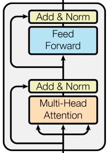

An encoder block is an abstraction of [Multi-Head Self-Attention](Multi-Head%20Self-Attention.md) 

---
## Definition
Let $X \in \mathbb{R}^{n \times d}$ be an input matrix comprised of (possibly positionally) encoded tokens. An encoder layer abstracts MHSA and is defined as:
$$
\begin{aligned}
Z_1 = \mathrm{LN}(X + \mathrm{MHSA}(X)), \\
\mathrm{Encoder}(X) = \mathrm{LN}(Z_1 + \mathrm{FFN}(Z_1))
\end{aligned}
$$ where $LN(\cdot)$ is a layer normalization operation and $FFN(\cdot)$ is a feed forward network.
## Example

Consider the example output from [Multi-Head Self-Attention](Multi-Head%20Self-Attention.md):
$$
Z_{MHSA} = \text{MHSA}(X) = \begin{bmatrix} 6.40 & 8.40 \\ 6.40 & 8.40 \\ 6.80 & 8.80 \end{bmatrix}
$$
Assume an input:  
$$  
X =  
\begin{bmatrix}  
1 & 2 \\  
1 & 2 \\  
1 & 2  
\end{bmatrix}  
$$
  
### Step 1: Residual + LayerNorm
We first apply element-wise residuals:
$$  
X + Z_{\mathrm{MHSA}} =  
\begin{bmatrix}  
7.40 & 10.40 \\  
7.40 & 10.40 \\  
7.80 & 10.80  
\end{bmatrix}  
$$  
  
Applying row-wise LayerNorm:  
$$  
Z_1 = \mathrm{LN}(X + Z_{\mathrm{MHSA}}) =  
\begin{bmatrix}  
-1 & 1 \\  
-1 & 1 \\  
-1 & 1  
\end{bmatrix}  
$$
### Step 2: Feed Forward Network  
Assume:  
$$  
\mathrm{FFN}(Z_1) =  
\begin{bmatrix}  
0 & 1 \\  
0 & 1 \\  
0 & 1  
\end{bmatrix}  
$$
### Step 3: Residual + LayerNorm  
$$  
Z_1 + \mathrm{FFN}(Z_1) =  
\begin{bmatrix}  
-1 & 2 \\  
-1 & 2 \\  
-1 & 2  
\end{bmatrix}  
$$
Applying LayerNorm:  
$$  
\mathrm{Encoder}(X) =  
\mathrm{LN}(Z_1 + \mathrm{FFN}(Z_1)) =  
\begin{bmatrix}  
-1 & 1 \\  
-1 & 1 \\  
-1 & 1  
\end{bmatrix}  
$$
### Final Output  
$$  
\mathrm{Encoder}(X) =  
\begin{bmatrix}  
-1 & 1 \\  
-1 & 1 \\  
-1 & 1  
\end{bmatrix}  
$$

